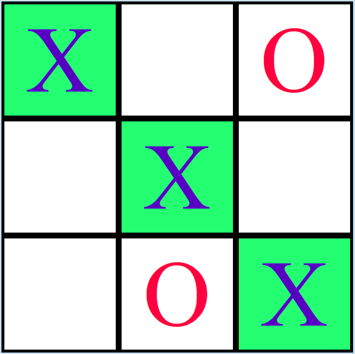

# Tic Tac Toe Game Design System Documentation

## Project Overview

This project is a web-based Tic Tac Toe game with user authentication, an admin panel, and a leaderboard. The game is implemented using PHP for server-side logic, JavaScript for client-side interactions, and CSS for styling.

## Design System

See [Design System](docs/design_system.md).

## Basic Usage

For detailed implementation specifics, refer to the individual files and their inline comments.

The index file opens an empty grid

When the mouse is moved over the grid the user can click and place a X.
Automaticly after a function in game.js place a O randomly in the grid.

When a player win the winnning line is highlight in green

If a player won or the grid is fulled a restart buttom below the grid appear

The score is kept at the top of the grid and increament X or O counter each time
respective player win.

## File Structure and Functionality

### 1. PHP Files

#### `index.php`

- Main game page
- Requires user authentication
- Displays the game board, score, and leaderboard
- Includes navigation and logout functionality

#### `game.php`

- Handles game logic and state management
- Processes player moves and AI responses
- Updates game status and board state
- Manages leaderboard and win statistics

#### `login.php`

- Handles user authentication
- Displays login form
- Processes login requests

#### `logout.php`

- Handles user logout
- Destroys session and redirects to login page

#### `admin.php`

- Admin panel for viewing all games
- Restricted to users with admin privileges
- Displays detailed game information and board states

#### `db.php`

- Database connection and query handling
- Includes functions for user authentication and logout

#### `log.php`

- Custom logging functionality for development purposes

### 2. JavaScript Files

#### `game.js`

- Manages client-side game interactions
- Handles board updates, player moves, and UI updates
- Communicates with server via AJAX calls

### 3. CSS Files

#### `global.css`

- Global styles and variables
- Defines color scheme and basic layout

#### `styles.css`

- Specific styles for the game board and UI elements

#### `admin.css`

- Styles for the admin panel

#### `login.css`

- Styles for the login page

## Key Components

1. **User Authentication**: Implemented in `login.php`, `logout.php`, and `db.php`.
2. **Game Logic**: Main game mechanics are handled in `game.php` with client-side support in `game.js`.
3. **Admin Panel**: Allows administrators to view all games and their states (`admin.php`).
4. **Leaderboard**: Tracks and displays top players.
5. **Database Integration**: Managed through `db.php` for storing game states, user information, and statistics.

## Design Patterns and Organization

- **MVC-like Structure**: Separation of concerns between data management (`db.php`), view (`index.php`, `admin.php`), and control logic (`game.php`).
- **Client-Server Interaction**: AJAX calls from `game.js` to `game.php` for real-time updates.
- **Responsive Design**: CSS is structured to provide a responsive layout across devices.

## Security Considerations

- Session-based authentication
- Admin access restrictions
- Prepared statements for database queries to prevent SQL injection

<b>Passwords are currently stored in plain text! This is highly insecure, and should never be used in production!</b>

<b>Postgres credentials are stored in db.php. This is highly insecure, and should never be used in production!</b>

## Future Improvements

- Enhanced error handling and logging
- Improved AI logic for computer moves
- Expanded admin functionalities
- User registration system
