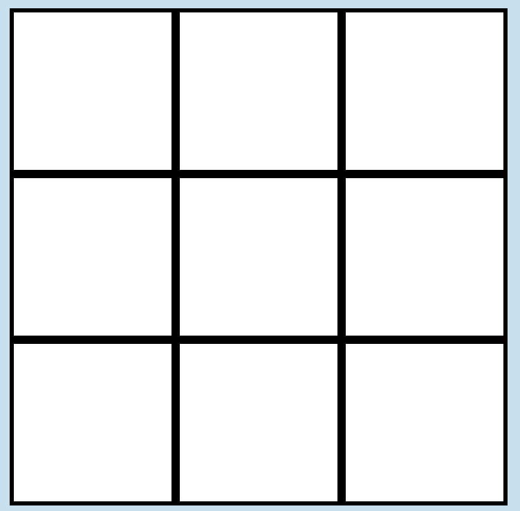
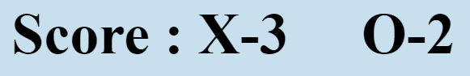

[Design System](docs/design_system.md)

The game is made from one html file call [index](index.html) 
One css file more desceribed in the Design System 
and one js file to deal with the logic and the rules of the games.

The index html open in a empty grid

When the mouse is moved over the grid the user can click and place a X.
Automaticly after a function in game.js place a O randomly in the grid.

When a player win the winnning line is highlight in green

If a player won or the grid is fulled a restart buttom below the grid appear

The score is kept at the top of the grid and increament X or O counter each time 
respective player win.

